# Publishing a rate

The rate is the only figure these models withhold on purpose. Premium is always published; a rate is
suppressed wherever the exposure it would be divided by is not the basis the policy was actually rated on.
Divide premium by the wrong exposure and the result is not a price, and no downstream normalization can
rescue it.

A rate here is **annual premium ÷ exposure**. Annual premium is a *rating* construct, not a ledger
figure: it does not tie to written or earned premium and is not meant to, and anything that must reconcile
to the financials reads written or earned premium, never annual premium (the full rule is in
[README.md](README.md)). The exposure is the **exposure base** as recorded at source —
`exposure_amount`, divided by a `divisor` where a program rates per hundred or per thousand of that base.

Everything in Part I is about that exposure: when the recorded exposure base is the true
rating basis, when it is not, and what the models do in each case. Part II then shows how each program
answers those questions in its own mechanics — enough that reading a rate should not require [programs.md](programs.md). This document stays on the published-rate concept; for how premium itself is calculated, see
[rating-mechanics-by-program.md](rating-mechanics-by-program.md).

---

# Part I — the method

## 1. What a published rate is

A published rate is a price per unit of the exposure base named in `rate_unit`, recorded at source, valued
at `rate_as_of` and re-valued as audits and endorsements land. It carries underwriting judgement — the
schedule credit/debit (IRPM) is in the charged rate, and stays in the normalized rate too; normalization
removes only the terms/ILF component (§2).

**It is comparable only within one `rate_comparison_group`.** The group equalises the *unit*, not the
*risk* — so wide dispersion by state and account size inside a group is expected, not a data problem. The
group is built from the exposure basis and its divisor; for count, flat and relativity bases it is
additionally scoped by program, because "per bed", "per vehicle" and "a percentage of the primary" mean a
different product in each program (the basis types are in the glossary). Two rates in different groups are
not two estimates of one number and must never be pooled.

**Absence is a finding.** A flat-charge policy has no exposure base to price; an excess or umbrella policy
carries no exposure of its own anywhere in the source (it is rated as a relativity to the underlying primary
premium). Those rows are retained with their full premium and must not be filtered — dropping them removes
money from every total and points a reader at source data that was never recorded.

## 2. The ladder

Three rungs, in increasing order of what has been stripped out. The rest of Part I refers to them
constantly, so they are defined here once:

- **Charged rate** — annual premium ÷ exposure. What was actually billed per unit. Contains everything:
  loss cost, expense load, limits, deductible, and underwriting judgement.
- **Manual rate** — the charged rate with the **IRPM (schedule modification) divided out**, leaving the
  rate before the underwriter's individual-risk credit or debit. It answers "how far off manual did we
  price". It exists only where that judgement is recorded as a separable factor.
- **Normalized rate** — the charged rate **restated to standard terms**: limits, deductible and retention held
  at a common standard (basic limits, first dollar) so two policies, or two terms of one policy, are
  compared at like coverage. It divides out the terms/ILF factor and nothing else. The standard it restates
  to is named in `normalization_basis`.

Which rungs publish, and why any is absent, is decided **per rung and per program** — §3 and Part II.

## 3. The decision sequence

Publication happens in **two stages**, and keeping them apart is the whole point of this section.

**Stage A decides whether a charged rate is published** — four tests in sequence, each of which can end in
"no rate" with a specific `rate_absence_reason`. **Stage B is separate and downstream:** once a charged rate
is published, the model tries to build each rung of the ladder and gates **each rung on its own**. A rung
can be withheld while the charged rate stands — which is why a policy routinely carries a sound charged rate
and no normalized rate. `rate_is_reportable`, the Stage A verdict, says nothing about whether the ladder is
available.

```mermaid
flowchart TD
  txn["A policy transaction"]

  subgraph A["Stage A — is a CHARGED RATE published?"]
    direction TB
    method["1. rating_method: how was this priced?"]
    exposure["2. exposure base + divisor resolved?"]
    basis["3. basis_status: one exposure base, or several?"]
    gate["4. rate_is_reportable: positive premium & exposure, dominance share met"]
    published["CHARGED RATE PUBLISHED"]
    method -->|"flat charge / negotiated / HNO-only / no exposure"| noRate["No charged rate — rate_absence_reason says which"]
    method --> exposure
    exposure -->|"nothing usable at source"| noRate
    exposure --> basis
    basis -->|"several bases, none dominant (not_comparable)"| noRate
    basis -->|"single / blended / dominant_basis"| gate
    gate -->|"fails"| noRate
    gate -->|"passes"| published
  end

  subgraph B["Stage B — the ladder, each rung gated INDEPENDENTLY"]
    direction TB
    norm["normalized_rate (restated to standard terms), or normalized_rate_absence_reason"]
    man["manual_rate (IRPM stripped out), or manual_rate_absence_reason"]
  end

  txn --> method
  published --> norm
  published --> man
```

**Stage A, test by test.** `rating_method` is how the policy was priced; four methods have no unit to price
at all — a flat charge, a negotiated premium, hired-and-non-owned auto with no owned vehicles, and no
exposure available — and each ends Stage A immediately. Where a unit exists, the model resolves the
**exposure base and its divisor**; nothing usable at source ends Stage A here. It then reads `basis_status`,
which records how many kinds of exposure base the premium is spread across and whether they reduce to one
comparable rate:

- `single` — one base;
- `blended` — several bases sharing a type and divisor, summed into one comparable unit;
- `dominant_basis` — several kinds, one carrying most of the premium, whose own rate is published unchanged
  (never a blend across kinds);
- `not_comparable` — several kinds, none dominant, which ends Stage A.

The first three survive to the final test.

### The Stage A quantitative gate, in full

`rate_is_reportable` on the current platform requires **all** of:

- `basis_status ∈ {single, blended, dominant_basis}` — any other status is `false`, never NULL
- `exposure_amount > 0`
- `rated_premium > 0` — `rated_premium` is the premium on rows that actually carry a rating basis — the
  premium the rate is struck on; it is smaller than annual (policy) premium, which also includes fees and unrated
  coverages
- `rate is not null`
- on `dominant_basis` only: `rated_premium_share >= 0.75` — `rated_premium_share` is `rated_premium` as a
  fraction of annual policy premium, i.e. how much of the whole policy the published rate represents

On the legacy platform it requires `basis_status = 'single'` plus the same three positives; legacy carries
one basis per term by construction, so `blended` and `dominant_basis` cannot arise.

**Not** in the gate — these are diagnostics, not gates (§6): `is_manual_premium_material`, `is_rate_outlier`,
`terms_coverage_share`, `premium_identity_holds`.

`fact_pds_policy_term` takes the **latest transaction that itself passes this gate**, not simply the latest
transaction, so a policy whose final endorsement was unrated does not read as unrateable.

## 4. Normalizing to standard terms: measured, and (optionally) fitted

The normalized rate (§2) needs a **terms factor** — the limits/deductible/retention load to divide out.
Where the rating factor stack is recorded on the rated rows, that factor is **measured** directly, and
`terms_coverage_share` reports how much of `rated_premium` carries a divisible terms factor. Below **0.90**
the normalized rate is withheld: dividing a factor computed on part of the premium into all of the rate
would silently assume the uncovered rows bought the same terms.

One switch — **off by default** — publishes a **fitted** terms factor for legacy-platform terms, which
record limits and a deductible but no factor stack. Two tiers, in precedence order:

| Tier | Source | Coverage | Fit error vs a recorded factor |
|---|---|---|---|
| 1 | `int_pds_legacy_terms_factor_anchor` — the factor recorded on **that insured's own successor term**, where identical limits and deductible were bought a year later | 113 of 311 published legacy terms | 0.10% median |
| 2 | `int_pds_estimated_terms_factor` — a **group mean** over program × state × limits × deductible | remaining 198 | 0.0% median Habitational; 3.1% Contractors, ~a quarter of Contractors terms >10% off |

Both estimate *this term's own* factor from the evidence available; neither substitutes another policy's
factor and neither moves the standard the rate is restated to. What matters about a fitted factor:

- **It is not labelled as estimated, by design.** It lands in `normalized_rate`, `terms_factor` and
  `normalization_basis` under the same basis string a measured factor carries — a distinct label would have
  refused every legacy-to-current comparison, which is the comparison the estimate exists to enable.
  `source = 'velocity'` is the estimated marker (with the switch off, no legacy term carries a normalized
  rate). Join `int_pds_legacy_terms_factor_anchor` to separate tier 1 from tier 2 — the ~30x accuracy gap
  makes the distinction matter.
- **Tier 2 is a group mean, not a policy's factor.** Adequate to normalize a rate; not adequate to price a
  policy or explain a single term's rate.
- **On an anchored (tier 1) term the normalized rate change equals the raw rate change.** Correct, not a
  bug: identical terms on both sides carry the same factor, so the difference normalization exists to remove
  is genuinely zero.
- **Scope: general liability only, inside an inception window.** Excess has no limit factor describing the
  terms purchased; business auto has an unresolved deductible component. Neither has anything to fit.
- **It cannot reach production** — `assert_estimated_normalization_is_off_in_production` fails a production
  build that carries it.

RSI general liability normalizes by a different route again — a factor **reconstructed** from limits and
retention rather than read per policy. That is a program-specific method and lives with the program in Part
II.

## 5. The parameters

Every constant that decides publication. **Hard** = the value is withheld; **flag** = published with a
warning column beside it. The program-scoped rows (renamed-unit, composite divisor, the RSI fitting
constants) are explained where the program is, in Part II.

| Parameter | Value | What it controls | Hard / flag |
|---|---|---|---|
| Dominance share | **0.75** | The premium share one exposure base must reach on a multi-base policy: first to be classed `dominant_basis` at all, then (measured as `rated_premium_share`) for that base's rate to stand in for the whole policy | Hard, both roles |
| Terms coverage share | **0.90** | How much of `rated_premium` the terms normalization must cover before a `normalized_rate` is published — per transaction and again per composite group | Hard |
| Composite plausibility band | **0.1 – 5000** | Plausible range for a negotiated-composite group's derived rate; a group rate outside it withholds the group rate and both ladder rungs | Hard |
| Material manual premium share | **0.10** | Sets `is_manual_premium_material` when an underwriter's manual plug reaches this share of rating premium. A warning only — never withholds | Flag — never suppresses |
| Outlier tail | **0.01** | The tail fraction at each end of a comparison group that sets `is_rate_outlier` and `is_schedule_mod_outlier` | Flag |
| Minimum outlier population | **100** rated rows | The smallest comparison group in which an outlier flag is computed — a minimum sample-size floor | Flag |
| Underlying match window | **45** days, or the excess incepting inside the primary's term | How close an excess/umbrella term must sit to a candidate primary to be paired to it — and so whether the excess policy has an underlying premium to rate against at all | Hard |
| Composite divisor scope | **1000**, TPM Contractors only | The per-thousand divisor is applied only to TPM Contractors composites; any other program's composite publishes no rate rather than one silently 1000x wrong | Hard |
| Renamed-unit exposure move | **0.25**, Sports & Entertainment only | On a renewal whose exposure *label* changed within the headcount family, the largest the recorded quantity may move (larger-over-smaller) and still count as a rename rather than a genuine change of unit | Hard |
| RSI reconstruction recency | **2025-01-01** inception | Which RSI terms the reconstructed limit factor is fitted from — the era that records the ILF explicitly instead of baking it into the base rate | Fitting scope |
| RSI reconstruction cell support | **5** terms | How many terms a state must contribute before its own reconstructed factor is used instead of the national one | Selects state vs national |
| RSI baked-factor floor | **1.3** | A recent RSI term whose recorded factor sits below this is treated as a residual baked-in term and dropped from the fit | Fitting scope |
| Schedule-mod transaction types | `Issue`, `Endorse`, `Cancel`, `Cancel Flat`, `Reinstate` | The transaction types whose premium ratio is accepted as a schedule modification; any other type is withheld until analysed | Hard |
| Estimated normalization switch | **on/off** | Whether legacy terms carry a *fitted* `normalized_rate` / `terms_factor` / `normalization_basis` at all (off by default; forbidden in production) | Hard |
| Successor-anchored precedence | condition | When a legacy term's successor bought identical limits and deductible, its recorded factor is used in place of the group mean — an exact match, not a tolerance | Selects between two estimates |
| Estimated normalization window | **2024-01-01** inception | Which legacy terms are in scope for a fitted factor; nothing earlier exists on the current platform to measure factor drift against | Hard |
| State support for a factor leg | **5** terms | Whether a factor leg is fitted from a state's own terms or from the program nationally; the cutoff was chosen by back-test | Selects state vs national |

### Why these values

- **Dominance at 0.75.** Refusing every mixed-basis policy would silence most of a book over a few percent
  of premium, and the suppressed rate is the one the underwriter actually quotes. A policy with one clearly
  dominant exposure base publishes that base's rate. The cutoff then applies a second time as a
  reportability bar, measured against **policy** premium (not rating premium) — a dominant base covering too
  little of the whole policy cannot represent it.
- **Terms coverage at 0.90.** Explained at §4: a terms factor computed on part of the premium and divided
  into all of the rate is a substituted value in a computed value's clothes.
- **The composite band bites at group grain, not policy grain.** A group with a cent or two of exposure
  produces a rate five orders of magnitude too high; aggregated to the policy it dilutes away and looks
  fine. Fixed constants, deliberately **not** derived per program.
- **Material-manual share is a flag, not a gate.** How an underwriter's manual plug should enter a rate is a
  question for each program's underwriters. Until they answer it, the models publish one consistently
  computed rate and flag where it misleads, rather than deciding on their behalf.
- **The outlier tail is a percentile, not a fixed band.** A hardcoded plausible band encodes today's price
  level and would mislabel the book after a few years of rate movement. The **100**-row population floor
  exists because `percent_rank` returns 0 and 1 in *any* group — in a cell of three, every row is a
  tail.

## 6. Diagnostics

Three kinds of column; conflating them is how a warning gets read as a gate.

### 6a. Distance-to-gate columns

Published beside the value they gate, so a consumer can widen a gate deliberately rather than discover it by
surprise.

| Column | Reads |
|---|---|
| `terms_coverage_share` | Share of rated premium carrying a divisible terms factor. Below 0.90 the normalized rate is withheld. Sits materially below 1 on one program for a structural reason, not a data gap: endorsements there do not restate the factor stack, so the source declines to repeat what it did not change |
| `rated_premium_share` | The rated premium as a share of annual **policy** premium. Below 0.75 on a dominant-basis policy, the rate is withheld |
| `dominant_basis_premium_share` | What the dominant basis covers — exactly what the published rate excludes. NULL off that tier |
| `manual_premium_share` | **Signed.** Negative means the rate reads high; positive means it covers less than the full price |
| `premium_outside_rate` | Rating premium the published rate does not cover, including the excluded dominant-basis remainder. Read this when a rate looks too low |
| `exposure_change_pct` | How far the recorded quantity moved between two renewal terms. On a Sports & Entertainment pair whose label changed within the headcount family, a move above 0.25 (larger-over-smaller) refuses the pair as a genuine change of unit rather than a rename |

### 6b. Flags that publish the value and warn

None suppresses anything. Read before quoting a number, not instead of it.

| Column | Warns |
|---|---|
| `is_manual_premium_material` | An underwriter's plug is ≥10% of rating premium, either direction |
| `is_rate_outlier` | The row sits in the outer 1% of its comparison group, in a group of ≥100 |
| `is_schedule_mod_outlier` | Our *explanation* of the price is suspect — distinct from `is_rate_outlier`, which says the price itself is unusual |
| `has_ambiguous_factor` | A factor was recorded twice with conflicting values, so a NULL beside it means *undeterminable*, not *unrecorded* |
| `has_unverified_terms_component` | An auto row's second deductible factor is doing real work while its role is unresolved |
| `rate_spread_pct` | How far the component rates behind a blended rate diverge. Exactly 0 on `single` and `dominant_basis` |
| `has_coverage_gap` / `has_short_interval` | More than 15 or fewer than 11 months between inceptions. Flagged, never excluded — whether a cancel-and-rewrite is a renewal is an underwriting question |
| `terms_changed_at_renewal` | What the insured bought moved, so a raw rate change is not a price signal. On legacy terms this is normally the **only** terms signal, and stays the thing to read even where estimated normalization supplies a magnitude |
| `basis_comparable_by_renamed_unit` | The pair is comparable because we judged its exposure label renamed, not because the source says the two units match. The judgement rests on the recorded quantity holding still. Exclude these for only pairs the source itself makes comparable |

### 6c. Reconciliation aids

| Column | Use |
|---|---|
| `premium_leakage` | Rating premium minus the sum of exposure components. Not netted, so it can detect uncharacterised gaps |
| `premium_leakage_explained` | The named cause: annual premium recorded against a zero exposure |
| `premium_identity_holds` | The premium decomposition closes to within half a cent |
| `premium_reconciles` | Term increments agree with the source's own cumulative written premium |
| `earning_precision` | A term inherits the **worst** precision among its transactions |

## 7. The absence-reason catalogue

Verbatim — readers grep the string they saw. **Live** = currently occurs; **latent** = the model can emit it
but no row does today.

### `rate_absence_reason` — no charged rate

| Reason | Status |
|---|---|
| `rated on fixed fees: a flat charge has no exposure, so no rate exists to find` | live |
| `priced by negotiation: the premium is a negotiated figure and ancillary coverages, with no rated coverage to strike a rate on` | live |
| `the policy is rated on several kinds of thing that cannot be added, and none of them dominates, so no single policy rate is honest` | live |
| `the dominant basis covers too little of the policy premium for its rate to represent the policy` | live — the 0.75 bar |
| `hired and non-owned auto only: there are no owned vehicles to rate on` | live |
| `no exposure found in the source for a policy that was expected to carry one` | live |
| `derived rate is outside the plausible band for this program, which indicates an unusable group exposure rather than a price` | live, composite groups only |
| `excess or umbrella with no primary policy matched in the book, so there is no premium to strike a relativity against` | latent |
| `no usable exposure survived: the recorded figures are zero or absent` | latent |
| `no rate could be computed from the recorded exposure and divisor` | latent |
| `no charged rate for this group` | latent |

### `normalized_rate_absence_reason` — a rate, but no terms-neutral restatement

| Reason | Status |
|---|---|
| `business auto is not normalized while the deductible factor role is unresolved` | live, the largest |
| `line has no terms factor -- the only limit factor identifies the excess tower rather than the terms purchased` | live |
| `no rated row in the published scope carries a limit factor` | live |
| `composite rate is struck per group on this policy -- see fact_pds_composite_group_rate` | live |
| `terms factor covers too little of the rated premium` | live — the 0.90 gate |
| `no rate is published for this transaction -- see rate_absence_reason` | live |
| `no factor stack in source` | live, every legacy term — while estimated normalization is off (the default) |
| `line is not covered by estimated normalization` | latent until the switch is on; then every legacy excess, auto, workers compensation and cyber term |
| `term incepts before estimated normalization begins` | latent until the switch is on; then every legacy term outside the window |
| `no estimated terms factor for the limits and deductible purchased` | latent until the switch is on; then a handful whose limits or deductible appear nowhere on the current platform |
| `no reportable rate to normalize` | latent until the switch is on. Separate from the reason above because the factor may exist — what is missing is the rate it would divide |
| `no reportable rated transaction in term` | live, term grain only |
| `no recent factor observed for these limits and retention` | live, RSI general liability — the reconstructed factor has no recent term at these limits and retention, and no national fallback |
| `self-insured retention credit could not be reconstructed reliably from the recent population` | live, RSI general liability — SIR terms withheld because their credit does not fall monotonically with retention on the few terms carrying each band |
| `no standard reference for this state` | latent, RSI general liability — no $1M/$2M reference could be built for the state, even nationally |
| `reconstructed factor is not positive` | latent, RSI general liability — a guard against a fitted factor at or below zero, which no cell produces today |
| `no limit factor stored` | live, rated-row grain |
| `no premium on this row` / `no exposure on this row` / `no achieved rate stored` | live, rated-row grain |
| `rate is struck at the policy rather than the rated row on this rating method` | live, rated-row grain |
| `no build-up row in this group carries a limit factor` | live, composite groups |
| `no usable charged rate for this group -- see rate_absence_reason` | live, composite groups |
| `terms factor covers too little of the group's build-up premium` | latent |
| `terms factor incomplete on this row` | latent |

### `manual_rate_absence_reason` — a rate, but no pre-judgement restatement

| Reason | Status |
|---|---|
| `no underwriting modification recorded on this program` | live |
| `no underwriting modification recorded on the rated rows` | live |
| `not separable from the negotiated composite rate` | live — absent by nature, not by omission |
| `no rate is published for this transaction -- see rate_absence_reason` | live |
| `no factor stack in source` | live, every legacy term — stays true whatever the normalization switch does, because `manual_rate` is never estimated |
| `no reportable rated transaction in term` | live, term grain only |

### `judgement_factor_absence_reason` and `terms_factor_absence_reason`

The inputs to the two rungs above, at rated-row grain:
`no underwriting modification recorded on this program` · `not separable from the negotiated composite rate` ·
`no rate modification factor or company deviation stored` · `no derived schedule modification for this
location` · `no limit factor stored` · `business auto is not normalized: a second deductible component is
priced on part of liability premium with its role unresolved in either direction` (live), and
`no rate modification factor stored` · `terms factor incomplete on this row` (latent).

### `rate_change_absence_reason` — no renewal comparison

| Reason | Status |
|---|---|
| `the two terms are rated on different kinds of thing, so the ratio is not a price change` | live |
| `the later term has no rate to compare` | live |
| `the earlier term has no rate to compare against` | live |
| `one term is rated on something with no comparable unit` | latent |

### `schedule_mod_absence_reason`

`withheld: this transaction type has not been analysed, so the ratio has not been shown to be a schedule
modification` — latent.

### `bridge_absence_reason` — no cross-system customer link

`legacy customer with no policy in the current system` · `renewal chain stays within the current system` ·
`new business, no predecessor recorded` · `named predecessor not found in the book` · `named predecessor could
not be identified to one customer`. All live.

**The registry is enforced.** `assert_absence_reasons_are_registered` fails the build on any reason string
not in this catalogue, and `assert_ladder_absence_reasons_are_exhaustive` asserts both directions — an absent
rung must state a reason, a present one must not.

## 8. Where each thing lives

Several gates and diagnostics exist only below term grain, so a reader on `fact_pds_policy_term` cannot see
them without a join.

| Grain | Model | Carries |
|---|---|---|
| Policy transaction | `fact_pds_policy_exposure_rate` | `rate_absence_reason`, all three thresholds that gate a policy rate, `terms_coverage_share`, `rated_premium_share`, `manual_premium_share`, `premium_outside_rate`, `premium_leakage` |
| Rated premium row | `fact_pds_policy_rate_component` | `row_achieved_rate_absence_reason`, `terms_factor_absence_reason`, `judgement_factor_absence_reason`, `has_ambiguous_factor` |
| Negotiated composite group | `fact_pds_composite_group_rate` | The plausibility band, the group's own `terms_coverage_share` |
| Transaction × basis × divisor | `fact_pds_policy_exposure_detail` | `is_rate_outlier`, `rate_percentile` |
| Policy term | `fact_pds_policy_term` | One `rate`, `rate_as_of`, the ladder and its two absence reasons. **No charged-rate absence reason** — join down for that |
| Renewal pair | `fact_pds_policy_renewal_rate_change` | `rate_change_absence_reason`, `basis_comparable`, `normalization_basis_comparable` |

**The gap to know:** `fact_pds_policy_term` tells you a rate is unreportable but not why —
`rate_absence_reason` lives at transaction grain and the rate fact holds no legacy transactions, so legacy
terms can carry no charged-rate reason at all.

---

# Part II — how each program does it

The method in Part I is uniform; the mechanics under it are not. Each program below is described only as it
bears on the published rate: what the rate is struck on, which rungs of the ladder publish and why, how (and
in which direction) normalization moves the rate, what makes a renewal pair comparable or not, and the one
trap that most often turns a rate into a wrong number. Premium formulas and factor dictionaries are out of
scope — see [rating-mechanics-by-program.md](rating-mechanics-by-program.md).

One cross-program warning first, because it is the most dangerous single fact here. **Normalization moves
the rate in opposite directions on different programs.** On the GL and auto programs standard terms sit at
the bottom of the factor range, so normalization restates rates **down** — roughly halving them. On senior
living the same factors run the other way and it restates **up**, about 1.6×. The direction is purely mechanical and is invisible in the number, which is why every row carries `normalization_basis` and why a
normalized rate must never be compared across bases.

## Habitational GL (TPM) — the reference case

The cleanest program in the book: one class-code rating layer, no composite override, no shadow build-up,
full price chain recorded on every rated row.

- **Struck on** apartment units (divisor 1), with square footage, features and tenant receipts rated
  alongside (divisor 1000). Units carry the overwhelming majority of premium, so the rate is a price per
  door — what underwriters quote.
- **Ladder.** Charged rate published and verified against the engine's own stored chain across every
  transaction type including cancellations. **Manual rate absent, with a stated reason** — no underwriting
  judgement is recorded anywhere on this program (the schedule-rating factors are pinned at neutral across
  the whole book), so there is nothing to divide out; the rate is not set equal to the charged rate.
  Normalized rate exact on every transaction — this is the measured-factor reference case §4 describes.
- **Normalization direction:** down.
- **Renewal:** the easiest book to read. Rated per door on both the legacy and current platforms, so almost
  every pair is comparable and little is withheld; a large share bridge the 2023 platform change. The few
  refusals are terms moving from units alone to a blend of units and something else.
- **Trap:** the charged rate is nearly silent because price and terms moved in opposite directions by
  similar amounts — the filed price fell close to a fifth between the last two program years while insureds
  bought materially more limit, and the achieved rate moved only a few percent. Read the charged rate alone
  and pricing looks flat; read the terms-adjusted (normalized) change instead.

## Contractors GL (TPM) — composite, with a netted back-solve

The largest book, predominantly New York Free Trade Zone business (exempt from filed rate and form
requirements), priced on loss experience and venue.

- **Struck on** receipts per $1,000, at a **single negotiated composite rate**. The divisor is supplied as a
  constant of 1000 because `rating_basis` is NULL on every composite row — this is the one program the
  composite-divisor-scope parameter (§5) protects, and any other program's composite publishes no rate
  rather than risk a silent 1000× error.
- **Ladder.** Charged rate = charged composite premium ÷ receipts × 1000. **No manual rate** — the
  negotiation *is* the judgement, so nothing is separable to divide out (`not separable from the negotiated
  composite rate`). Normalized rate published, using a premium-weighted terms factor read off the
  shadow class-code build-up rows.
- **Normalization direction:** down.
- **Renewal:** a composite-rated term compares across the 2023 platform change (both platforms label the
  exposure composite receipts, and it agrees to the dollar). What is refused is a composite-rated term
  paired against a **class-code-rated** one — that is a difference of rating method, not of naming.
- **Trap:** the class-code build-up rows are **not premium**. They are the derivation of the composite rate;
  summed naively they exceed the entire book. Related: a minority of policies look class-code rated and are
  not — an underwriter back-solved a composite price by running the build-up at full manual rate and booking
  a large **negative** manual plug to bring the total down. On that population the plug is **netted into the
  rate** (it makes the premium in the rate equal the policy's own charged premium exactly), so those policies carry a
  correct rate rather than none, and every one is flagged. This netting is the exception, not the rule —
  everywhere else a material plug is flagged and left outside the rate.

## Sports & Entertainment GL (RSI) — many units, a reconstructed normalization

The most varied book: around twenty distinct exposure units carrying genuinely different prices (an
attendant priced in cents, an event in hundreds of dollars).

- **Struck on** whichever unit dominates. Where a policy mixes units and one clearly leads, its own rate is
  published (`dominant_basis`); where nothing dominates, no rate is published rather than a meaningless
  blend (`not_comparable`).
- **Ladder.** All three rungs. The charged rate is **derived from premium ÷ exposure**, not read from a
  stored base rate — see the trap. Manual rate reads the schedule-rating factor directly (real and rising on
  this program; over half of rated exposure now carries a credit); a positive manual plug on a few dozen
  rows sits *beside* an already-correct rate and is flagged, not netted. Normalized rate is **reconstructed**
  (below).
- **Normalization — reconstructed, not read per policy.** RSI records the increased-limit factor
  inconsistently: for identical coverage the recorded factor drifts from about 0.9 on older terms to about
  2.0 on recent ones as the limit load migrated out of the base rate and into an explicit factor. Dividing
  each policy by its own recorded factor would under-adjust the baked terms and over-adjust the explicit
  ones, and at renewal a policy crossing from baked to explicit would read a ~50% price cut that never
  happened. So the model divides the charged rate — the same total however the price was split into base and factor — by a factor **rebuilt from the limits
  and retention the policy bought** — a robust median over recent RSI terms at those limits and retention,
  expressed relative to a $1M/$2M first-dollar term in the same state. The §5 RSI parameters (recency
  2025-01-01, cell support 5, baked-factor floor 1.3) govern that fit. About 87% of reportable RSI terms
  resolve a reconstructed normalized rate; SIR terms are withheld (their credit does not fall monotonically
  with retention), and unsupported limit/retention cells are withheld with a stated reason. This
  reconstruction is **interim**, intended to be replaced by a direct ISO increased-limit-factor lookup once
  the licensed tables are loaded. Direction: down.
- **Renewal:** this is the book where the **exposure unit itself moves** at renewal, and it is the largest
  single reason a pair is withheld. Three shapes: a genuine unit change (refused — the ratio is a mechanical artifact, not a price change); a **rename** within the headcount family (published and flagged
  `basis_comparable_by_renamed_unit`, allowed only because the recorded quantity held still, per the 0.25
  renamed-unit parameter in §5); and a single basis becoming a blend (refused). The relabelled pairs turned
  out price-neutral.
- **Trap:** nearly a fifth of premium carries **no stored rate at all** — it was overridden at entry and the
  source kept only the resulting premium. That is precisely why the charged rate is derived from premium and
  exposure here rather than read from the chain.

## Senior Living HPL (KBSI) — normalization runs the other way

Professional liability for senior living and skilled nursing, the subsidiary's primary line.

- **Struck on** a weighted **skilled bed equivalent** — beds counted by level of care (occupied, not
  licensed) and weighted to a common unit. The exposure is stored in the factor records rather than the
  limit records, so a search built on the GL pattern finds nothing; the exposure is present, just elsewhere.
- **Ladder.** All three rungs, and this is the only program with a genuine **recorded** manual premium. The
  schedule modification's *magnitude* is not stored — only a flag that one was applied — so the model
  derives it as a residual, labels it derived, and computes it at location grain; read it with the location
  count beside it and never present it as a source value.
- **Normalization direction — up, and this is the trap.** Three of this program's factors run opposite to
  every other: the deductible factor is a multiplier rather than a subtracted credit, the limit factor
  reduces the price rather than loading it, and neutral terms sit at the *top* of every factor range. So
  normalization restates senior living rates **up** (~1.6×) where it restates every other program's down. A
  senior living normalized rate placed beside a GL one is meaningless — the guard is `normalization_basis`.
- **Renewal:** clean — per skilled bed on both terms — and it publishes a terms-adjusted change because the
  factor stack is recorded. The one caution is the direction above: the model publishes a normalized rate
  change only when both terms share a normalization basis, so a senior-living change is never pooled with a
  GL one.

## Business Auto (all three subsidiaries) — normalized declined

The only cross-subsidiary line, rated per vehicle per coverage and summed.

- **Struck on** the vehicle count (a count basis, divisor 1). The published rate is premium per vehicle.
- **Ladder.** Charged rate and manual rate published. **Normalized rate declined, deliberately** — one
  deductible factor's behaviour is unresolved on roughly 15% of liability premium, too much to guess on
  (`business auto is not normalized while the deductible factor role is unresolved`, the largest single
  normalized-absence reason in the book).
- **Renewal:** per vehicle within a program, so a customer's auto renewal compares cleanly. There is no
  terms-adjusted change (auto is not normalized), so read `terms_changed_at_renewal` — off the recorded
  limits and deductible — rather than a magnitude.
- **Trap:** a cancellation deletes the whole vehicle schedule, so the exposure goes to zero and **auto is
  the only line where a cancellation publishes no rate.** The premium is not the obstacle — the coverage
  rows survive and carry a real annual price — only the exposure vanishes. Separately, the fleet count
  includes a small share of vehicles the engine never priced (about 2%), which dilutes the rate but can
  never overstate it.

## Umbrella / Excess (TPM, RSI, KBSI) — a relativity, no rungs

The one line with **no exposure of its own** anywhere in the source: no class codes, no exposure limits, no
risk schedule.

- **Struck on** the underlying primary premium — the published measure is a **relativity** (a percentage),
  not a price per unit. It is program-scoped in the comparison group, because the same percentage is a
  different product in each program.
- **The underlying premium has two rules.** It is the **primary casualty line only** (General Liability, or
  professional liability where that is the program's primary line); business auto premium is carried as a
  memo column and stays out, because including it would move the relativity only on accounts that happen to
  place auto with us. The excess term is matched to the primary in force during its term, and a mid-term
  excess is priced against the full annual underlying — the 45-day underlying-match parameter (§5) governs
  whether a primary is found at all, and so whether the policy has an underlying premium to rate against.
- **Ladder.** The relativity only. **No manual and no normalized rate** — both absences are properties of
  the product, not gaps. Normalization is impossible because the only limit factor identifies which excess
  tower this is, not what the customer bought; dividing it out would erase the distinction between two
  genuinely different contracts.
- **Renewal:** the change in that relativity year over year, which is a real price signal. Pairing is within
  one line, so the two Contractors towers never compare against each other even though they share a
  comparison group.
- **Trap:** the limit factor identifies the **product**, not the purchase (above). And almost every excess
  term reads as having no deductible — that is correct: excess attaches above a retention, so the right
  answer is *not applicable*, not zero.

## Legacy Velocity (pre-2025) — a rate, but no mechanics

Not a program but the platform PDS replaced; only Contractors and Habitational have any legacy population.
Velocity has one generic exposure column, no basis label and no factor stack — but it does record its own
rate. So **the rate is available and the rating mechanics are not.**

- **Ladder.** Charged rate only. No manual rate under any circumstances — nothing in the legacy source
  stands in for an underwriting modification. Normalized rate is NULL by default (`no factor stack in
  source`), and appears only when the estimated-normalization switch is on — then it is fitted, tier-1
  successor-anchored or tier-2 group-mean, per §4.
- **Trap:** a legacy term looks like a current-platform term in `fact_pds_policy_term` but is not. The rate
  fact holds current-platform transactions only, so **no charged-rate absence reason exists for a legacy
  term** — check `source` before concluding anything about a missing rate or factor.
- **Two settled facts about the legacy rate**, so they are not re-litigated: the rate is **not annualized**
  on any term length (premium and exposure already cover the same period, so their ratio is term-length
  independent — validated against the platform's own recorded rate); and a **cancellation is a restatement,
  not a short term** — the platform rewrites the expiration date to the cancellation date, so the stored
  span is not a term length, and the return-premium credit is excluded from the premium the rate is struck on.

---

## Glossary

Reference for the terms Part I introduces in flow; nothing here that is not defined above.

- **Charged rate** — annual premium ÷ exposure; the billed price per unit, judgement included.
- **Manual rate** — charged rate with the IRPM (schedule modification) divided out.
- **Normalized rate** — charged rate restated to standard terms (limits/deductible/retention held at a common
  standard); `normalization_basis` names the standard.
- **`basis_status`** — how many kinds of exposure base a policy's premium spans: `single`, `blended`
  (several of one type and divisor, summed), `dominant_basis` (several kinds, one ≥75% of premium),
  `not_comparable` (several kinds, none dominant → no rate).
- **`rated_premium`** — premium on rows carrying a rating basis; the premium the rate is struck on, smaller than
  annual (policy) premium.
- **`rated_premium_share`** — `rated_premium` ÷ annual policy premium; how much of the policy the rate
  represents (the 0.75 dominance reportability bar reads this).
- **`terms_coverage_share`** — fraction of `rated_premium` whose rows carry a divisible terms factor (the
  0.90 normalized-rate gate reads this).
- **`rate_comparison_group`** — the only set within which two rates may be compared; built from basis and
  divisor, program-scoped for count/flat/relativity bases.
- **Exposure basis types** — every basis resolves to one of five: **Currency** (a dollar amount, e.g. gross
  sales, receipts), **Area** (square footage), **Count** (business objects — units, beds, vehicles),
  **Flat** (a fixed charge, no per-unit rate exists), **Relativity** (a percentage of another premium, e.g.
  underlying primary premium). Currency and Area compare across programs; Count, Flat and Relativity do not.
