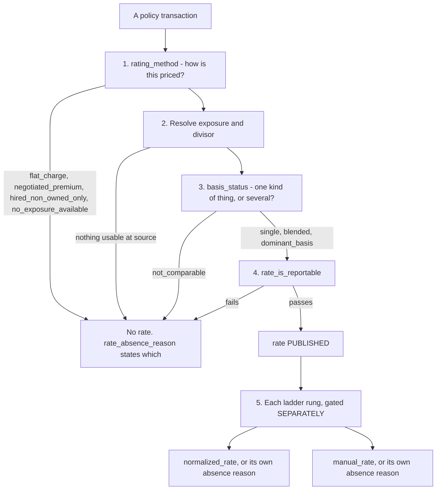

# Publishing a rate

A rate is the only figure in these models that is **withheld on purpose**. Premium is always published; a rate
often is not. This page is the contract: why a rate exists at all, what publishing one claims, how each
decision is made, and every number and reason involved.

Read this before writing a rate query. The gates are not edge cases — the largest of them withholds a
normalized rate on more than sixteen hundred transactions.

---

## 1. Why a rate is published at all

Premium alone cannot answer *did we get rate*. A policy that costs more this year may simply be bigger: more
receipts, more units, more vehicles. Dividing premium by the thing it was priced on removes the size and
leaves the price.

```
rate = annual premium ÷ (exposure ÷ divisor)
```

That is the whole idea, and everything on this page follows from one consequence of it: **the division is
only meaningful if the denominator is the thing the policy was actually rated on.** Where it is not, no
arithmetic makes the result a price, so the models publish nothing and say why.

The counterpart rule is in [README.md](README.md) and bears repeating here: the rate's numerator is annual
premium, which is a *rating* construct. It deliberately does not tie to the ledger. **Anything that must
reconcile to the financials uses written or earned premium, never the rate numerator.**

---

## 2. What "published" claims — and what it does not

When a rate is published, these four things are being asserted:

- it is a **price per unit**, not a ratio of two convenient numbers
- the unit means what `rate_unit` says it means
- the exposure was **recorded at source**, not inferred or substituted
- it is valued at **`rate_as_of`**, and it moves as audits and endorsements land

Publishing a rate does **not** claim any of the following, and each has bitten someone:

| Not claimed | Where the real rule is |
|---|---|
| Comparable to another policy's rate | Only within one `rate_comparison_group` — see [programs.md](programs.md) |
| Adjusted for risk | The group makes the *unit* comparable, not the *risk*. Rates vary many times over by state and account size inside one group |
| Reconcilable to written premium | The numerator is annual premium; see §1 |
| Stable | It is valuation-dated. A later audit changes it |
| Free of underwriter judgement | The charged rate contains it. So does the normalized rate — see §6 |

**The absence of a rate is a finding, not a gap.** A flat-charge policy has no unit to price. An excess policy
carries no exposure of its own anywhere in the source. Those rows are kept, carry real premium, and must not
be filtered out — dropping them removes money from every total and sends a reader hunting for source data
that never existed.

### The one exception: an estimated normalized rate on legacy terms

Everything above describes numbers **measured** from source. There is one switch that publishes a number that
is **fitted** instead, and it is off by default.

The legacy platform records limits and a deductible amount but no rating factors, so a normalized rate cannot
be computed there at all. The switch estimates the legacy term's **own** baked-in terms factor from two
sources, in precedence order:

| Precedence | Source | Reaches | Accuracy against a recorded factor |
|---|---|---|---|
| 1 | `int_pds_legacy_terms_factor_anchor` — the factor **recorded on that insured's own successor**, where they bought identical limits and deductible a year later | 113 of 311 published legacy terms | 0.10% median error |
| 2 | `int_pds_estimated_terms_factor` — a **group average** over program, state, limits and deductible | the remaining 198 | 0.0% median on Habitational, 3.1% on Contractors |

Neither substitutes another policy's factor for this one's, and neither changes the neutral standard the rate
is restated to. Both are estimates of *this* term's own factor; they differ only in the evidence available.

What you need to know if you find one:

- **Nothing in the data marks it estimated, or says which of the two produced it.** It lands in
  `normalized_rate`, `terms_factor` and `normalization_basis`, using the same basis string a measured one
  carries. That was the point — a distinct label would have refused every legacy-to-current comparison, which
  is the comparison the estimate exists to make. `source = 'velocity'` **is** the estimated marker: with the
  switch off no legacy term carries a normalized rate. To tell tier 1 from tier 2, join
  `int_pds_legacy_terms_factor_anchor` — a row there means the anchored figure was used. **The two differ in
  accuracy by roughly thirty times, so this matters.**
- **It is a group average in tier 2, not a policy's factor.** Good enough to restate a rate to comparable
  terms. Not good enough to price a policy or explain one term's rate.
- **The two programs are not equally reliable in tier 2.** Habitational reproduces the recorded factor almost
  exactly; Contractors carries real dispersion, with roughly a quarter of terms landing more than ten per cent
  away. Exact figures are in the model's YAML description.
- **On an anchored term the normalized rate change equals the raw rate change.** That is correct, not a bug:
  both sides of the pair carry the same factor because the insured's terms did not move. Removing that
  spurious difference is what tier 1 is for. It does not reveal hidden rate change.
- **It is scoped**: general liability only, and only terms incepting inside a window, because the fitted
  factors are current-era. Excess has no limit factor describing the terms purchased and business auto has an
  unresolved deductible component, so neither has anything to fit to.
- **It must not reach production.** `assert_estimated_normalization_is_off_in_production` fails a production
  build that carries it.

---

## 3. How it is decided, in order

Five decisions, in sequence. A rate survives only if all five allow it.



**Step 5 is the one readers get wrong.** The rungs are gated independently of the rate, so a policy can
publish a perfectly good charged rate and still withhold its normalized rate. `rate_is_reportable` says
nothing about whether the ladder is available.

### Step 4 in full, because no other page states it

`rate_is_reportable` on the current system requires **all** of:

- `basis_status` is `single`, `blended` or `dominant_basis` — any other status is `false`, never NULL
- `exposure_amount > 0`
- `rated_premium > 0`
- `rate is not null`
- and on `dominant_basis` only, additionally `rated_premium_share >= 0.75`

On the legacy platform it requires `basis_status = 'single'` plus the same three positives. Legacy carries one
basis per term by construction, so `blended` and `dominant_basis` cannot arise there.

Note what is **not** in the gate: `is_manual_premium_material`, `is_rate_outlier`, `terms_coverage_share`,
`premium_identity_holds`. Those are warnings, not gates — see §6.

`fact_pds_policy_term` takes the **latest transaction that itself passes this gate**, not simply the latest
transaction. Otherwise a policy whose final endorsement happened to be unrated would look unrateable.

---

## 4. The thresholds

Every number that decides whether something is published. **Hard** means the value is withheld; **flag**
means the value is published with a warning column beside it.

| Threshold | Value | What it gates | Hard / flag |
|---|---|---|---|
| Dominance share | **0.75** | Two separate things: whether `basis_status` becomes `dominant_basis`, **and** whether such a policy's rate is reportable at all, via `rated_premium_share` | Hard, both roles |
| Terms coverage share | **0.90** | `normalized_rate` and `normalization_basis`, at transaction grain and at composite-group grain | Hard |
| Composite plausibility band | **0.1 to 5000** | The composite group's rate and both its rungs | Hard |
| Material manual premium share | **0.10** | `is_manual_premium_material` only | **Flag — never suppresses** |
| Outlier tail | **0.01** | `is_rate_outlier`, `is_schedule_mod_outlier` | Flag |
| Minimum outlier population | **100** rated rows | Whether an outlier flag is computed at all | Flag |
| Underlying match window | **45** days, or the excess incepting inside the primary's term | Whether an underlying primary is found — and so whether an excess policy has a denominator | Hard |
| Composite divisor scope | **1000**, TPM Contractors only | Any other program's composite publishes **no** rate rather than one silently wrong by 1000x | Hard |
| Renamed-unit exposure move | **0.25**, Sports & Entertainment only | Whether a renewal pair whose exposure label moved *within the headcount family* may be compared. Measured as the larger recorded quantity over the smaller, so direction of travel does not matter. Above it the pair is refused as a genuine change of unit | Hard |
| RSI reconstruction recency | **2025-01-01** inception | Which RSI terms the reconstructed factor is fitted from — the era where the increased-limit factor is recorded explicitly rather than baked into the base rate. A judgement about a recording convention, not a coverage cutoff | Fitting scope |
| RSI reconstruction cell support | **5** terms | Terms needed before a state-specific reconstructed factor is used rather than the national one, per the same leg-fallback logic as the legacy estimator | Neither — selects state vs national |
| RSI baked-factor floor | **1.3** | A recent RSI term whose recorded factor sits below this is dropped from the fit as a residual baked term — it lies in the empty gap below the explicit cluster | Fitting scope |
| Schedule-mod transaction types | `Issue`, `Endorse`, `Cancel`, `Cancel Flat`, `Reinstate` | A transaction type nobody has analysed is withheld by default | Hard |
| Estimated normalization switch | **on** | Whether legacy terms carry an estimated `normalized_rate`, `terms_factor` and `normalization_basis` at all | Hard |
| Successor-anchored precedence | n/a | Where a legacy term's successor bought identical limits and deductible, its recorded factor is used instead of the group average. Not a threshold — a condition, and exact rather than tolerant | Neither — it selects between two estimates |
| Estimated normalization window | **2024-01-01** inception | Which legacy terms are inside it. A judgement, not a measurement — the current platform holds no earlier term in these programs to measure factor drift against | Hard |
| State support for a factor leg | **5** terms | Whether a factor leg is estimated from the state's own terms or from the program nationally. Chosen by back-test: below it a state cell loses to the national estimate, above it state signal is discarded on cells that carry it | Neither — it selects between two estimates |

### Why these numbers rather than others

**Dominance at 0.75, and why it exists at all.** Refusing every mixed-basis policy would silence most of a
book over a few percent of premium, and the rate suppressed would be the one the underwriter actually quotes.
So a policy with one clearly dominant basis publishes that basis's rate. The same cutoff then applies a second
time as a reportability bar — and this is the part no other page says — measured against **policy** premium
rather than rating premium. A dominant basis that covers too little of the whole policy cannot represent it.

**Terms coverage at 0.90.** The terms factor is computed from the rated rows that carry a limit factor. If it
covers only part of the premium and is then divided into all of the rate, the arithmetic silently assumes the
uncovered rows bought the same terms. That is a substituted value wearing a computed value's clothes.

**The composite band bites at group grain where it does not at policy grain.** A group with a cent or two of
exposure produces a rate five orders of magnitude too high; aggregated to the policy it is diluted away and
looks fine. The band is a fixed pair of constants, **not** derived per program.

**The material-manual share is a flag, not a gate, deliberately.** How an underwriter's manual premium plug
should enter a rate is each program's underwriters' question. Until they answer it, the models publish one
consistently computed rate and a flag saying where it misleads, rather than choosing on their behalf.

**The outlier tail is a percentile, not a fixed band.** A hardcoded plausible band encodes today's price level
and would mislabel the whole book after a few years of rate movement. The population floor of 100 exists
because `percent_rank` returns 0 and 1 in *any* partition — in a group of three, every row is a tail.

**The renamed-unit move at 0.25, and why the quantity is the test rather than the label.** Sports &
Entertainment records the same headcount under several interchangeable names, so a policy's exposure label
can move between its own two terms while the thing counted does not. Refusing those pairs withholds a real
price change for a naming reason. But the label pair alone is **not** a safe test: one policy moves between
two of these labels with the count rising several times over and premium nearly flat, which is a genuine
change of unit wearing a pair of labels that elsewhere means a rename. Publishing it would have implied a
rate cut of roughly four fifths that nobody granted.

So the recorded quantity has to hold still as well, and that is evidence about the **unit**: an unchanged
count means the unit was renamed rather than re-measured, and the plausible rate change follows from that
rather than justifying it. It is measured as the larger recorded quantity over the smaller, so a pair is
judged identically whichever direction it travelled — a signed ratio would have allowed a count falling by a
quarter while refusing the same two numbers rising.

The cutoff sits in an empty band rather than near a boundary: the largest allowed movement is about 18% and
the nearest refused one about 42%, so it is not tuned to admit a particular policy. Both edges are pinned by
`assert_habitational_rsi_gl_renewal_worked_examples`, which fixes the nearest refusal as well as the allowed
pairs — without that the threshold could be relaxed a long way, or tightened until it admitted nothing, with
every other assertion still passing. One pair sits just outside it and is refused conservatively, because a
genuine re-measurement cannot be ruled out there.

---

## 5. The absence-reason catalogue

Verbatim, because a reader greps the string they saw. **Live** means it currently occurs; **latent** means the
model can emit it but no row does today.

### `rate_absence_reason` — no charged rate

| Reason | Status |
|---|---|
| `rated on fixed fees: a flat charge has no exposure, so no rate exists to find` | live |
| `priced by negotiation: the premium is a negotiated figure and ancillary coverages, with no rated coverage to strike a rate on` | live |
| `the policy is rated on several kinds of thing that cannot be added, and none of them dominates, so no single policy rate is honest` | live |
| `the dominant basis covers too little of the policy premium for its rate to represent the policy` | live — the 0.75 bar |
| `hired and non-owned auto only: there are no owned vehicles to rate on` | live |
| `no exposure found in the source for a policy that was expected to carry one` | live |
| `derived rate is outside the plausible band for this program, which indicates an unusable group exposure rather than a price` | live, composite groups only |
| `excess or umbrella with no primary policy matched in the book, so there is no premium to strike a relativity against` | latent |
| `no usable exposure survived: the recorded figures are zero or absent` | latent |
| `no rate could be computed from the recorded exposure and divisor` | latent |
| `no charged rate for this group` | latent |

### `normalized_rate_absence_reason` — a rate, but no terms-neutral restatement

| Reason | Status |
|---|---|
| `business auto is not normalized while the deductible factor role is unresolved` | live, the largest |
| `line has no terms factor -- the only limit factor identifies the excess tower rather than the terms purchased` | live |
| `no rated row in the published scope carries a limit factor` | live |
| `composite rate is struck per group on this policy -- see fact_pds_composite_group_rate` | live |
| `terms factor covers too little of the rated premium` | live — the 0.90 gate |
| `no rate is published for this transaction -- see rate_absence_reason` | live |
| `no factor stack in source` | live, every legacy term — **while estimated normalization is off**, which is the default |
| `line is not covered by estimated normalization` | latent until the switch is on; then every legacy excess, auto, workers compensation and cyber term |
| `term incepts before estimated normalization begins` | latent until the switch is on; then every legacy term outside the window |
| `no estimated terms factor for the limits and deductible purchased` | latent until the switch is on; then a handful whose limits or deductible appear nowhere on the current platform |
| `no reportable rate to normalize` | latent until the switch is on. Separate from the reason above because the factor may well exist — what is missing is the rate it would divide |
| `no reportable rated transaction in term` | live, term grain only |
| `no recent factor observed for these limits and retention` | live, RSI general liability — the reconstructed factor has no recent term at these limits and retention, and no national fallback |
| `self-insured retention credit could not be reconstructed reliably from the recent population` | live, RSI general liability — SIR terms are withheld because their credit does not fall monotonically with retention on the few terms that carry each band |
| `no standard reference for this state` | latent, RSI general liability — no $1M/$2M reference could be built for the state, even nationally |
| `reconstructed factor is not positive` | latent, RSI general liability — a guard against a fitted factor at or below zero, which no cell produces today |
| `no limit factor stored` | live, rated-row grain |
| `no premium on this row` / `no exposure on this row` / `no achieved rate stored` | live, rated-row grain |
| `rate is struck at the policy rather than the rated row on this rating method` | live, rated-row grain |
| `no build-up row in this group carries a limit factor` | live, composite groups |
| `no usable charged rate for this group -- see rate_absence_reason` | live, composite groups |
| `terms factor covers too little of the group's build-up premium` | latent |
| `terms factor incomplete on this row` | latent |

### `manual_rate_absence_reason` — a rate, but no pre-judgement restatement

| Reason | Status |
|---|---|
| `no underwriting modification recorded on this program` | live |
| `no underwriting modification recorded on the rated rows` | live |
| `not separable from the negotiated composite rate` | live — absent **by nature**, not by omission |
| `no rate is published for this transaction -- see rate_absence_reason` | live |
| `no factor stack in source` | live, every legacy term — and here it stays true whatever the normalization switch does, because `manual_rate` is never estimated |
| `no reportable rated transaction in term` | live, term grain only |

### `judgement_factor_absence_reason` and `terms_factor_absence_reason`

The inputs to the two rungs above, at rated-row grain:
`no underwriting modification recorded on this program` · `not separable from the negotiated composite rate` ·
`no rate modification factor or company deviation stored` · `no derived schedule modification for this
location` · `no limit factor stored` · `business auto is not normalized: a second deductible component is
priced on part of liability premium with its role unresolved in either direction` (live), and
`no rate modification factor stored` · `terms factor incomplete on this row` (latent).

### `rate_change_absence_reason` — no renewal comparison

| Reason | Status |
|---|---|
| `the two terms are rated on different kinds of thing, so the ratio is not a price change` | live |
| `the later term has no rate to compare` | live |
| `the earlier term has no rate to compare against` | live |
| `one term is rated on something with no comparable unit` | latent |

### `schedule_mod_absence_reason`

`withheld: this transaction type has not been analysed, so the ratio has not been shown to be a schedule
modification` — latent.

### `bridge_absence_reason` — no cross-system customer link

`legacy customer with no policy in the current system` · `renewal chain stays within the current system` ·
`new business, no predecessor recorded` · `named predecessor not found in the book` · `named predecessor could
not be identified to one customer`. All live.

**The registry is enforced.** `assert_absence_reasons_are_registered` fails the build on any reason string not
in this catalogue, and `assert_ladder_absence_reasons_are_exhaustive` asserts both directions of the
contract — an absent rung must state a reason, and a present one must not.

---

## 6. The diagnostics, and what to do with each

Three different kinds of column, and conflating them is how a warning gets read as a gate.

### 6a. The numbers behind a gate — so you can see how close you are

Each of these is published *beside* the value it gates, so a consumer can widen a gate deliberately rather
than discovering it by surprise.

| Column | Tells you |
|---|---|
| `terms_coverage_share` | How much of the rated premium carries a divisible terms factor. Below 0.90 the normalized rate is withheld. It sits materially below 1 on one program for a structural reason, not a data problem: endorsements there do not restate the factor stack, so the source is declining to repeat what it did not change |
| `rated_premium_share` | The published numerator as a share of annual **policy** premium. Below 0.75 on a dominant-basis policy, the rate is withheld |
| `dominant_basis_premium_share` | What the dominant basis covers — i.e. exactly what the published rate excludes. NULL off that tier |
| `manual_premium_share` | **Signed.** Negative means the rate reads high; positive means it covers less than the full price |
| `premium_outside_rate` | Rating premium the published rate does not cover, including the excluded dominant-basis tail. The column to read if a rate looks too low |
| `exposure_change_pct` | How far the recorded quantity moved between two terms of a renewal pair. Where a Sports & Entertainment pair's exposure label changed within the headcount family, a move above 0.25 — measured larger over smaller, so direction does not matter — refuses the pair as a genuine change of unit rather than a rename |

### 6b. Flags that publish the value and warn it may mislead

None of these suppresses anything. Read them before quoting a number, not instead of it.

| Column | Warns that |
|---|---|
| `is_manual_premium_material` | An underwriter's plug is at least 10% of rating premium, in either direction |
| `is_rate_outlier` | The row sits in the outer 1% of its comparison group, in a group of at least 100 |
| `is_schedule_mod_outlier` | Our *explanation* of the price is suspect — a different signal from `is_rate_outlier`, which says the price is unusual |
| `has_ambiguous_factor` | A factor was recorded twice with conflicting values, so a NULL beside it means *undeterminable*, not *unrecorded* |
| `has_unverified_terms_component` | An auto row's second deductible factor is doing real work while its role is unresolved |
| `rate_spread_pct` | How far the component rates behind a blended rate diverge. Exactly 0 on `single` and `dominant_basis` |
| `has_coverage_gap` / `has_short_interval` | More than 15 or fewer than 11 months between inceptions. Flagged, never excluded — whether a cancel-and-rewrite is a renewal is an underwriting question |
| `terms_changed_at_renewal` | What the insured bought moved, so a raw rate change is not a price signal. On legacy terms this is normally the **only** terms signal available, and stays the thing to read even where estimated normalization supplies a magnitude |
| `basis_comparable_by_renamed_unit` | The pair is comparable because we judged its exposure label to have been renamed, not because the source says the two units are the same. The judgement rests on the recorded quantity holding still. Exclude these if you want only pairs the source itself makes comparable |

### 6c. Reconciliation aids

| Column | Use |
|---|---|
| `premium_leakage` | Rating premium minus the sum of exposure components. Deliberately not netted, so it can detect uncharacterised gaps |
| `premium_leakage_explained` | The named cause: annual premium recorded against a zero exposure |
| `premium_identity_holds` | The premium decomposition closes to within half a cent |
| `premium_reconciles` | Term increments agree with the source's own cumulative written premium |
| `earning_precision` | A term inherits the **worst** precision among its transactions |

---

## 7. Where each thing lives

Several gates and diagnostics exist only below term grain, so a reader on `fact_pds_policy_term` cannot see
them without a join.

| Grain | Model | Carries |
|---|---|---|
| Policy transaction | `fact_pds_policy_exposure_rate` | `rate_absence_reason`, all three thresholds that gate a policy rate, `terms_coverage_share`, `rated_premium_share`, `manual_premium_share`, `premium_outside_rate`, `premium_leakage` |
| Rated premium row | `fact_pds_policy_rate_component` | `row_achieved_rate_absence_reason`, `terms_factor_absence_reason`, `judgement_factor_absence_reason`, `has_ambiguous_factor` |
| Negotiated composite group | `fact_pds_composite_group_rate` | The plausibility band, the group's own `terms_coverage_share` |
| Transaction × basis × divisor | `fact_pds_policy_exposure_detail` | `is_rate_outlier`, `rate_percentile` |
| Policy term | `fact_pds_policy_term` | One `rate`, `rate_as_of`, the ladder and its two absence reasons. **No charged-rate absence reason** — join down for that |
| Renewal pair | `fact_pds_policy_renewal_rate_change` | `rate_change_absence_reason`, `basis_comparable`, `normalization_basis_comparable` |

**The gap to know about:** `fact_pds_policy_term` tells you a rate is unreportable but not why, because
`rate_absence_reason` lives at transaction grain and the rate fact holds no legacy transactions. Legacy terms
can therefore carry no charged-rate reason at all.
